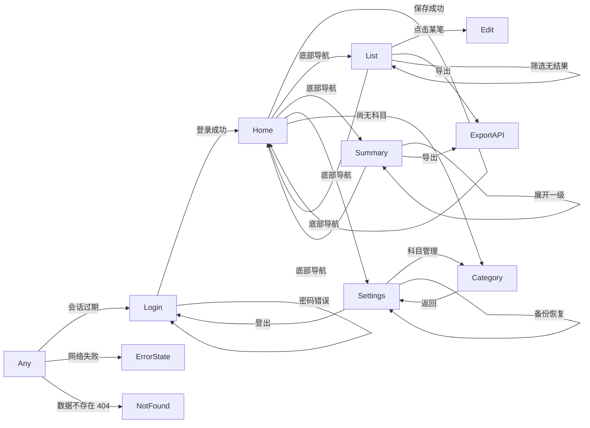

# 集体台账 · 设计方案

| 项 | 内容 |
|----|------|
| 版本 | 0.23（最近一次修订；v0.1~v0.3 原始设计内容保留追溯） |
| 状态 | 已交付（**功能口径以 [04-dev-manual.md](./04-dev-manual.md) 为准**，版本演进以 `git log` / Releases 为准） |
| 创建日期 | 2026-09-02 |
| 依赖文档 | [需求澄清记录](./01-requirements.md)、[PRD](./02-prd.md)、[v0.23 认证页修订](./23-v0.23-认证页错误提示与会话拦截修复.md) |
| 配套原型 | [prototype.html](./prototype.html) |

---

## 1. 设计总览

### 1.1 架构概览

单容器部署的 Go 服务，同时承担 API 与静态资源托管；前端为 Vue 3 SPA，构建产物编译进 Go 二进制。

```
手机 / 桌面浏览器
      │  HTTPS（局域网内）
      ▼
┌─────────────────────────────────────┐
│  Docker 容器（运行于 NAS 本机）        │
│                                     │
│  ┌───────────────────────────────┐  │
│  │  Go 二进制（单进程）            │  │
│  │                               │  │
│  │  Gin Router                   │  │
│  │   ├─ /api/*  → JSON API       │  │
│  │   └─ /*      → 内嵌静态资源    │  │
│  │                               │  │
│  │  service 层（业务规则 + 留痕）  │  │
│  │       │                       │  │
│  │  repo 层（SQL）                │  │
│  └───────────┬───────────────────┘  │
│              │                      │
│  ┌───────────▼────────┐  ┌────────┐ │
│  │  SQLite 数据文件     │  │ 备份目录│ │
│  │  （本地卷，非网络挂载）│  │（可挂NAS）│ │
│  └────────────────────┘  └────────┘ │
└─────────────────────────────────────┘
```

**关键点**：静态资源通过 Go 的 `embed` 包编译进二进制，运行时无需 Nginx，最终镜像可基于
`scratch`，体积约 20MB。

### 1.2 技术栈（引用 PRD 第 6 章，此处不再决策）

| 层级 | 方案 | 版本 |
|------|------|------|
| 前端 | Vue 3 + TypeScript + Vite + Pinia + Vant | 3.5.41 / 5.9+ / 8.2.1 / 4.x |
| 后端 | Go + Gin | 1.27.1 / v1.12.0 |
| 数据层 | SQLite（modernc.org/sqlite 纯 Go） | v1.3x |
| 部署 | Docker 单容器，NAS 本机运行 | - |

### 1.3 关键设计决策

| 决策 | 备选方案 | 选择理由 |
|------|----------|----------|
| 静态资源编译进 Go 二进制 | 双容器（Nginx + Go）/ Go 托管外部目录 | 单进程、单镜像，部署最简单，最省内存 |
| 金额以**整数分**存储 | 浮点 / DECIMAL 字符串 | 杜绝浮点累加误差。台账数字对不上是致命问题 |
| 前后端类型各自定义，以接口契约为唯一真相 | 用 OpenAPI 生成 TS 类型 | 项目规模小，代码生成器带来的构建复杂度不划算；改用接口契约文档 + 人工同步 |
| 留痕写入放在 service 层做字段 diff | 数据库触发器 / 手写每个接口的留痕代码 | 集中一处，新增字段时不易漏掉；触发器在 SQLite 上调试困难 |
| 科目删除用「引用计数 + 拒绝」 | 级联删除 / 软删除后隐藏 | 需求决策 D0 要求可追溯优先，物理删除不可接受 |
| 会话存 SQLite，不用 JWT | JWT 无状态 | 单容器部署，JWT 的无状态优势不成立；服务端会话可即时失效 |
| PWA 只做静态资源缓存，不做数据离线 | Service Worker 缓存 API 响应 + 同步队列 | 需求明确不做真离线；引入离线同步会带来冲突解决复杂度 |

---

## 2. 页面结构

### 2.1 页面清单

| 页面 | 路径 | 职责 | 核心元素 | 入口 | 权限要求 |
|------|------|------|----------|------|----------|
| 登录 | `/login` | 账号密码登录 | 账号、密码、登录按钮 | 直接访问；未登录自动跳转 | 无 |
| 记账 | `/` | **默认首页**，快速记一笔（**纯收支**） | 收支切换、金额输入、二级科目选择、摘要、保存 | 登录后默认页；底部导航 | 已登录 |
| 流水列表 | `/transactions` | 查看与筛选流水与转账记录 | 筛选栏、混合列表、转账标记、导出、编辑/作废入口 | 底部导航 | 已登录 |
| 汇总 | `/summary` | 按科目分级查看区间小计与资金构成 | 月份选择、资金构成三卡、科目余额、收支小计、导出 | 底部导航 | 已登录 |
| 科目管理 | `/categories` | 管理一/二级科目 **+ 发起科目间转账** | 转账表单、科目树、余额类型/期初/勾稽设置、重命名、停用、删除 | 底部导航「设置」内 | 已登录 |
| 设置 | `/settings` | 备份恢复、改密码、登出 | 备份列表、立即备份、恢复、修改密码、登出 | 底部导航 | 已登录 |

> 共 6 页，符合 MVP ≤ 8 页的限制。移动端以底部导航在「记账 / 流水 / 汇总 / 设置」间切换。

### 2.2 页面跳转关系



**异常路径说明**：

| 异常 | 处理 |
|------|------|
| 会话过期 | 需要登录的 API 返回 401 → 清除本地状态 → 跳转 `/login` 并提示「登录已过期」。**例外**：`/auth/login`、`/auth/register`、`/auth/reset-password` 的 401/400 是业务结果（如「账号或密码错误」），按服务端 `error.message` 原样显示在对应输入框同行，不触发跳转（见 `23-v0.23-认证页错误提示与会话拦截修复`） |
| 网络失败 | 页面内错误条 + 「重试」按钮；**记账表单已填内容不清空** |
| 资源不存在（404） | 显示「内容不存在或已被删除」+ 返回按钮 |
| 服务器错误（5xx） | 显示「服务暂时不可用」+ 重试；错误信息记入服务端日志 |

### 2.3 页面详情

#### P1. 登录（`/login`）

| 区块 | 内容 | 数据来源 | 交互 |
|------|------|----------|------|
| 主体 | 组织名（上次登录的组织，缺省显示系统名）、账号输入、密码输入、登录按钮 | `localStorage` 组织名；`/api/auth/registration-status` | 输入、提交 |
| 底部 | 「注册组织」入口（仅系统尚无用户时显示）、「忘记密码？」入口 | — | 跳转 `/register`、`/reset-password` |

| 状态 | 展示 |
|------|------|
| 正常 | 空白表单 |
| 空数据 | 不适用 |
| 加载中 | 登录按钮转圈且禁用 |
| 加载失败 | 错误文案显示在**对应输入框同一行右侧**（不撑高布局、不产生页面滚动），保留账号、清空密码 |
| 已登录访问 | 直接重定向到 `/` |

#### P2. 记账（`/`，默认首页，纯收支）

| 区块 | 内容 | 数据来源 | 交互 |
|------|------|----------|------|
| 顶部 | 今日日期、今日已记 N 笔、今日收/支合计 | `GET /api/summary?date=today` | 点击跳转流水列表 |
| 主体 | 收/支切换；表单自上而下：**日期（默认今天）→ 摘要 → 科目（二级）→ 金额**；保存 | `GET /api/categories` | 切换、输入、选择、提交 |
| 底部 | 底部导航（记账 / 流水 / 汇总 / 设置） | — | 切换页面 |

> ⚠️ **本页只记收支。** 科目间转账（D7）的**发起入口在「科目管理」页**（用户明确要求：转账是科目间
> 操作，放记账页与收支概念混且界面不佳）；本页的流水列表仍会显示转账记录（带标记，见 P3）。

| 状态 | 展示 |
|------|------|
| 正常 | 表单可填，科目下拉仅列启用中的科目 |
| 空数据（无科目） | 表单区替换为引导卡片：「还没有科目，先去创建」+ 跳转科目管理按钮 |
| 加载中 | 科目选择器骨架屏，其余可填 |
| 加载失败 | 科目区错误条 + 重试；**已填金额不丢失** |
| 保存失败 | 字段下方红字提示具体原因（金额不合法 / 未选科目），内容全部保留 |

> **表单顺序（用户定）**：日期 → 摘要 → 科目 → 金额。金额是录入的**最后一步**，输完拇指自然落在保存键。
> **移动优先要点**：日期默认今天（免输）；金额框数字键盘（`inputmode="decimal"`）；
> 保存后重置表单并聚焦「日期」，支持连续录入；保存按钮固定在底部，拇指可达。

#### P3. 流水列表（`/transactions`）

| 区块 | 内容 | 数据来源 | 交互 |
|------|------|----------|------|
| 顶部 | 筛选栏（日期区间、**类型：全部/收支/转账**、科目、关键字、金额范围）、导出按钮 | `GET /api/categories` | 展开/收起筛选、提交筛选 |
| 主体 | 流水与转账**混合列表**，按日期倒序，同日分组；收支行显示方向/金额/科目，转账行显示「转出 A → B、C」并带「转账」标记 | `GET /api/transactions` + `GET /api/transfers` | 「全部」时并行拉取按日期归并（年 ~2000 条可承受）；点击行展开操作（收支：编辑 / 作废 / 变更历史；转账：作废 / 变更历史） |
| 底部 | 当前筛选下的收/支/结余小计 + 底部导航 | 同列表接口返回 | — |

| 状态 | 展示 |
|------|------|
| 正常 | 列表 + 日分组小计 |
| 空数据 | 空状态插画 + 「还没有流水，去记一笔」按钮；若因筛选为空则显示「清除筛选」 |
| 加载中 | 骨架屏 5 行 |
| 加载失败 | 错误条 + 重试按钮，保留当前筛选条件 |
| 已作废流水 / 转账 | 默认隐藏；顶部提供「显示已作废」开关，显示时该行置灰加删除线 |

#### P4. 汇总（`/summary`）

| 区块 | 内容 | 数据来源 | 交互 |
|------|------|----------|------|
| 顶部 | 月份/区间选择器、导出按钮 | — | 切换区间、导出 |
| 主体 1·**资金构成** | 银行存款余额 / 专项资金合计 / **未分配资金** 三个数字卡 | `GET /api/summary` → `capital` | 无（常驻展示） |
| 主体 2·科目余额 | 一级科目列表，每行显示**科目余额**；展开显示其下二级科目的余额与本期发生额 | 同上 | 点击一级行展开/收起 |
| 主体 3·收支小计 | 收入合计 / 支出合计 / 结余；按科目的本期发生额小计 | 同上 | — |
| 底部 | 底部导航 | — | 切换页面 |

> **未分配资金 = 银行存款余额 − Σ(参与勾稽的科目余额)**，见需求文档 D6。
> 这个数字回答的是「银行里的钱，有多少是专项资金不能动，多少是自有资金」。

| 状态 | 展示 |
|------|------|
| 正常 | 资金构成三卡 + 科目余额 + 收支小计 |
| 空数据 | 「本月还没有流水」+ 去记账按钮；资金构成仍显示（银行存款期初余额存在时） |
| 加载中 | 骨架屏 |
| 加载失败 | 错误条 + 重试 |
| **未分配为负** | 资金构成区顶部橙色警告条：「专项资金合计已超过银行存款余额，请检查科目期初余额设置」 |
| 无权限 | 不适用（单人系统） |

#### P5. 科目管理（`/categories`，含科目间转账）

| 区块 | 内容 | 数据来源 | 交互 |
|------|------|----------|------|
| 顶部 | 「**科目间转账**」按钮、「新增一级科目」按钮、返回 | — | 展开转账表单、新增、返回设置 |
| 主体 1·**转账发起** | 转出科目（单选，旁显当前余额）+ 转入明细（科目 + 金额，可增删行）+ 快捷摘要标签（年末结转 / 收益分配 / 专款调剂）+ 保存 | `GET /api/categories`（含余额） | 加行、输入、实时合计校验、提交 |
| 主体 2·科目树 | 一级科目为分组头，其下列出二级科目；每行显示**名称 / 类型标签 / 期初余额 / 当前余额 / 流水数 / 状态 / 操作** | `GET /api/categories` | 新增二级、重命名、改期初余额、停用/启用、删除 |
| 底部 | 说明文字：「已被引用的科目不能删除，只能停用」 | — | — |

> **转账为什么放这页**（用户决策）：转账是科目间的操作，不是收支；放记账页与「记收支」混在一起
> 概念不清、界面也挤。此页余额信息齐全（转出方余额就在旁边），发起转账最顺手。

**转账表单要点（见 D7）**：

| 项 | 说明 |
|---|---|
| 转出科目 | 单选，选项旁显示**当前余额**（R3 实时提示「可转出 ¥X」） |
| 转入明细 | 科目下拉（**花费型科目不出现**，R4）+ 金额，可增删行；行尾实时显示已分配总额 |
| 合计校验 | 已分配总额 ≠ 转出金额时，保存按钮置灰 + 提示差额 |
| 摘要预填 | 快捷标签：「年末结转」「收益分配」「专款调剂」，可自定义 |
| 转账记录去向 | 保存后在「流水」列表出现（带「转账」标记），可作废/撤销（F1/P3） |

**新建/编辑科目表单字段**：

| 字段 | 控件 | 必填 | 说明 |
|------|------|:---:|------|
| 科目名称 | 文本框 | 是 | — |
| 余额类型 | 单选：余粮型 / 花费型 | 是 | 余粮型＝收增支减（还剩多少）；花费型＝支增收减（累计花了多少）。**已有流水后不可改** |
| 期初余额 | 金额框 | 否 | 默认 0。建科目时自定义，之后仅由流水改变 |
| 参与资金勾稽 | 开关 | 否 | **仅余粮型可开启**；花费型时置灰并提示原因 |
| 所属一级科目 | 下拉 | 二级必填 | 新建后不可改（不支持改挂） |

| 状态 | 展示 |
|------|------|
| 正常 | 转账表单 + 科目树，每行显示余额 |
| 空数据 | 「还没有科目」+ 新增一级科目按钮（转账表单同步置灰） |
| 加载中 | 骨架屏 |
| 加载失败 | 错误条 + 重试 |
| 转账校验失败 | 保存区红字（转出总额 ≠ Σ转入 / 余额不足 / 花费型作转入方），表单完整保留 |
| 删除被拒绝 | 弹窗提示「该科目下仍有 N 笔流水，无法删除。你可以将其停用」+ 直接停用按钮 |
| 停用确认 | 弹窗提示影响范围，确认后执行 |
| **花费型勾选勾稽** | 开关置灰 + 提示「只有余粮型科目能参与资金勾稽」 |
| **改已有流水科目的期初余额** | 弹窗警告「该科目已有 N 笔流水，修改期初余额会改变其余额」+ 写入 change_log |

#### P6. 设置（`/settings`）

| 区块 | 内容 | 数据来源 | 交互 |
|------|------|----------|------|
| 主体 1·**资金账户** | 银行存款期初余额（金额输入框 + 保存）、下方显示当前银行存款余额 | `GET/PUT /api/settings` | 修改、保存 |
| 主体 2·备份恢复 | 备份区（上次备份时间、立即备份、备份列表、恢复） | `GET /api/backups` | 点击操作 |
| 主体 3·账号 | 科目管理入口、修改密码、登出 | — | 点击操作 |
| 底部 | 版本号、底部导航 | — | — |

| 状态 | 展示 |
|------|------|
| 正常 | 各功能区 |
| 空数据（无备份） | 「尚无备份记录」+ 立即备份按钮 |
| 加载中 | 骨架屏 |
| 加载失败 | 错误条 + 重试 |
| 恢复中 | 全屏遮罩「正在恢复，请勿关闭页面」，完成后强制重新登录 |

---

## 3. 目录结构

### 3.1 结构总览

```
jititaizhang/
├── docs/                          需求、设计、原型
│   ├── 01-requirements.md
│   ├── 02-prd.md
│   ├── 03-design.md
│   └── prototype.html
│
├── web/                           前端（Vue 3 + TS + Vite）
│   ├── src/
│   │   ├── features/              按特性组织
│   │   │   ├── auth/              登录、会话状态
│   │   │   ├── transaction/       记账、流水列表、筛选、编辑、作废
│   │   │   ├── summary/           分级汇总
│   │   │   ├── category/          科目树管理
│   │   │   └── settings/          备份恢复、改密码
│   │   ├── components/            跨特性复用组件（无业务含义）
│   │   ├── lib/                   HTTP 客户端、金额格式化、日期工具
│   │   ├── types/                 共享 TS 类型
│   │   ├── router/
│   │   ├── App.vue
│   │   └── main.ts
│   ├── public/                    PWA manifest、图标
│   ├── index.html
│   ├── vite.config.ts
│   ├── tsconfig.json
│   └── package.json
│
├── server/                        后端（Go + Gin）
│   ├── cmd/server/main.go         入口
│   ├── internal/
│   │   ├── auth/                  登录、会话、中间件
│   │   ├── transaction/           handler / service / repo
│   │   ├── category/
│   │   ├── summary/
│   │   ├── export/                CSV 与 xlsx 流式生成
│   │   ├── changelog/             变更留痕（被各 service 调用）
│   │   ├── backup/                备份与恢复
│   │   └── platform/              配置、DB 连接、迁移、错误响应、日志
│   ├── migrations/                SQL 迁移脚本
│   ├── go.mod
│   └── go.sum
│
├── deploy/
│   ├── Dockerfile                 多阶段构建，最终基于 scratch
│   ├── docker-compose.yml         含数据卷与备份卷定义
│   └── .env.example
├── scripts/
│   ├── build.sh                   前端构建 + Go 编译
│   └── dev.sh                     本地并行启动前后端
├── tests/
├── .gitignore
├── CHANGELOG.md
└── README.md
```

### 3.2 目录职责约定

| 目录 | 放什么 | 不放什么 |
|------|--------|----------|
| `web/src/features/*/` | 某个业务特性的页面、组件、store、API 调用 | 跨特性复用的通用组件 |
| `web/src/components/` | 无业务含义的通用 UI 组件（按钮、弹窗、空状态、骨架屏） | 任何含业务逻辑的组件 |
| `web/src/lib/` | HTTP 客户端封装、金额/日期格式化等纯函数 | 组件、状态、业务规则 |
| `server/internal/*/service.go` | 业务规则、流程编排、留痕触发 | HTTP 请求解析、SQL 语句 |
| `server/internal/*/repo.go` | SQL 查询与数据映射 | 业务规则判断 |
| `server/internal/*/handler.go` | 请求解析、参数校验、响应序列化 | 业务逻辑 |
| `server/internal/platform/` | 配置、数据库连接、迁移、中间件、统一错误响应 | 任何具体业务的规则 |
| `server/migrations/` | 版本化 SQL 迁移脚本，只增不改 | 手工执行的临时 SQL |

### 3.3 命名与组织约定

- **分层方式**：**按特性分层**。理由：特性相关的代码集中一处，改动时认知负担显著低于跨目录跳转
- **文件命名**：Vue 组件 PascalCase（`.vue`）；TS 模块 camelCase；Go 文件 snake_case
- **Go 特性目录内固定三件套**：`handler.go` / `service.go` / `repo.go`；共享类型放各包 `model.go`
- **单个文件行数上限**：前端 300 行，Go 400 行，超出即拆分
- **禁止**：`utils/` / `helpers/` / `common/` 这类垃圾桶目录 —— 放不下的东西说明分类还不对

---

## 4. 数据层设计

### 4.1 数据表

#### user
| 字段 | 类型 | 约束 | 说明 |
|------|------|------|------|
| id | INTEGER | PK | 主键 |
| username | TEXT | NOT NULL, UNIQUE | 登录账号 |
| password_hash | TEXT | NOT NULL | bcrypt 哈希 |
| created_at | DATETIME | NOT NULL | 创建时间 |

#### category
| 字段 | 类型 | 约束 | 说明 |
|------|------|------|------|
| id | INTEGER | PK | 主键 |
| name | TEXT | NOT NULL | 科目名称 |
| level | INTEGER | NOT NULL, CHECK(level IN (1,2)) | 1 一级 / 2 二级 |
| parent_id | INTEGER | FK → category(id), NULL | 一级为 NULL，二级必填 |
| status | TEXT | NOT NULL, CHECK(status IN ('active','inactive')) | 启用 / 停用 |
| balance_type | TEXT | NOT NULL, CHECK(balance_type IN ('residual','spending')) | 余粮型（收增支减）/ 花费型（支增收减） |
| opening_balance_cents | INTEGER | NOT NULL DEFAULT 0 | 期初余额（分），建科目时自定义 |
| include_in_reconciliation | INTEGER | NOT NULL DEFAULT 0, CHECK(include_in_reconciliation IN (0,1)) | 是否参与资金勾稽 |
| sort_order | INTEGER | NOT NULL DEFAULT 0 | 同级排序 |
| created_at / updated_at | DATETIME | NOT NULL | 时间戳 |

> ⚠️ **表级 CHECK 约束**（必须建，防止脏数据破坏资金勾稽）：
> `CHECK (NOT (balance_type = 'spending' AND include_in_reconciliation = 1))`
> 理由：花费型科目余额为正数，若参与勾稽会在「银行存款 − Σ勾稽余额」中被二次扣减，导致未分配算错。

#### app_setting（系统配置）
| 字段 | 类型 | 约束 | 说明 |
|------|------|------|------|
| key | TEXT | PK | 配置键 |
| value | TEXT | NOT NULL | 配置值 |

> 关键项：`bank_opening_balance_cents`（银行存款期初余额，分）。
> 银行存款是唯一真实资金账户，**不是科目**。

> 唯一索引：`CREATE UNIQUE INDEX idx_category_name ON category(parent_id, name)`
> （SQLite 中 NULL 不参与唯一性比较，需额外为一级科目建 partial unique index）

#### transaction
| 字段 | 类型 | 约束 | 说明 |
|------|------|------|------|
| id | INTEGER | PK | 主键 |
| txn_date | TEXT | NOT NULL | 业务日期 `YYYY-MM-DD` |
| direction | TEXT | NOT NULL, CHECK(direction IN ('income','expense')) | 收 / 支 |
| amount_cents | INTEGER | NOT NULL, CHECK(amount_cents > 0) | **金额（分），正整数** |
| category_id | INTEGER | NOT NULL, FK → category(id) | 指向**二级**科目 |
| note | TEXT | NULL | 摘要 |
| status | TEXT | NOT NULL, CHECK(status IN ('normal','voided')) | 正常 / 已作废 |
| created_at / updated_at | DATETIME | NOT NULL | 时间戳 |

#### transfer（转账，见 D7）
| 字段 | 类型 | 约束 | 说明 |
|------|------|------|------|
| id | INTEGER | PK | 主键 |
| txn_date | TEXT | NOT NULL | 业务日期 |
| source_category_id | INTEGER | NOT NULL, FK → category(id) | 转出科目（二级） |
| source_amount_cents | INTEGER | NOT NULL, CHECK(> 0) | 转出总额（分） |
| note | TEXT | NULL | 摘要（如「年末结转」） |
| status | TEXT | NOT NULL, CHECK(status IN ('normal','voided')) | 正常 / 已作废 |
| created_at / updated_at | DATETIME | NOT NULL | 时间戳 |

#### transfer_leg（转账转入明细）
| 字段 | 类型 | 约束 | 说明 |
|------|------|------|------|
| id | INTEGER | PK | 主键 |
| transfer_id | INTEGER | NOT NULL, FK → transfer(id) ON DELETE CASCADE | 所属转账 |
| category_id | INTEGER | NOT NULL, FK → category(id) | 转入科目（二级） |
| amount_cents | INTEGER | NOT NULL, CHECK(> 0) | 转入金额（分） |

> ⚠️ **转入科目的花费型禁入**通过应用层校验 + service 预检实现（跨表 CHECK 需触发器，
> SQLite 上不可靠）；同笔转账 Σ(leg.amount) = source_amount 同样在 service 层校验。
> 为转账建索引：`transfer(txn_date)`、`transfer_leg(transfer_id)`、`transfer(source_category_id)`。

#### change_log
| 字段 | 类型 | 约束 | 说明 |
|------|------|------|------|
| id | INTEGER | PK | 主键 |
| entity_type | TEXT | NOT NULL | `transaction` / `category` |
| entity_id | INTEGER | NOT NULL | 实体 id（**不加外键约束**，实体删除后痕迹仍需保留） |
| action | TEXT | NOT NULL | `create` / `update` / `void` / `unvoid` / `status` |
| field | TEXT | NULL | 变更字段名 |
| old_value / new_value | TEXT | NULL | 改前 / 改后值 |
| changed_at | DATETIME | NOT NULL | 变更时间 |

#### session
| 字段 | 类型 | 约束 | 说明 |
|------|------|------|------|
| id | TEXT | PK | 会话 token（随机 32 字节 hex） |
| user_id | INTEGER | NOT NULL, FK → user(id) | 关联用户 |
| expires_at | DATETIME | NOT NULL | 过期时间 |

### 4.2 关系与级联

```
category.parent_id  → category.id       自关联（一级 → 二级）
transaction.category_id → category.id   仅可指向 level=2 的科目
session.user_id     → user.id           会话删除时级联
change_log.entity_id                    逻辑关联，无外键约束
```

**索引设计**：

| 索引 | 用途 |
|------|------|
| `idx_txn_date` on transaction(txn_date DESC) | 流水列表倒序、日期区间筛选 |
| `idx_txn_category` on transaction(category_id) | 按科目汇总 |
| `idx_txn_status` on transaction(status) | 过滤已作废 |
| `idx_txn_date_status` on transaction(txn_date, status) | 列表主查询的复合索引 |
| `idx_category_parent` on category(parent_id) | 科目树查询 |

**级联策略**：

| 操作 | 策略 |
|------|------|
| 删除 user | 级联删除其 session；change_log 保留 |
| 删除 category | 仅当**未被任何 transaction 引用**且（一级）无子科目时允许；否则拒绝 |
| 删除 transaction | **永远禁止物理删除**（需求决策 D0） |
| 更新 transaction / category | 自动写 change_log |

### 4.3 接口清单

> MVP 共 12 个接口 = 6 页面 × 2，符合「接口数不超过页面数 × 2」的约束。

| # | 方法 | 路径 | 说明 | 请求 | 响应 | 权限 |
|---|------|------|------|------|------|------|
| 1 | POST | `/api/auth/login` | 登录 | `{username, password}` | `{ok}` + Set-Cookie | 无 |
| 2 | POST | `/api/auth/logout` | 登出 | — | `{ok}` | 已登录 |
| 3 | GET | `/api/categories` | 科目树（含每科目流水数） | — | `CategoryNode[]` | 已登录 |
| 4 | POST | `/api/categories` | 新建科目 | `{name, level, parentId?, balanceType, openingBalanceCents?, includeInReconciliation?}` | `Category`（含计算后的 `balance`） | 已登录 |
| 5 | PUT | `/api/categories/:id` | 重命名 / 停用 / 启用 / 改期初余额 | `{name?, status?, openingBalanceCents?}` | `Category` | 已登录 |
| 6 | DELETE | `/api/categories/:id` | 删除（仅未被引用的） | — | `{ok}` | 已登录 |
| 7 | GET | `/api/transactions` | 流水列表 + 筛选 | query: `from,to,categoryId,keyword,minAmount,maxAmount,includeVoided,page` | `{items, total, summary}` | 已登录 |
| 8 | POST | `/api/transactions` | 记一笔 | `{date, direction, amountCents, categoryId, note?}`（`categoryId` **必填**） | `Transaction` | 已登录 |
| 9 | PUT | `/api/transactions/:id` | 编辑字段 / 作废 / 撤销作废 | `{date?, direction?, amountCents?, categoryId?, note?, status?}` | `Transaction` | 已登录 |
| 10 | GET | `/api/transactions/:id/changes` | 变更历史 | — | `ChangeLog[]` | 已登录 |
| 11 | GET | `/api/summary` | 分级小计 + 科目余额 + 资金构成 | query: `from,to` | `{incomeTotal, expenseTotal, balance, groups[], capital}` | 已登录 |
| 12 | GET | `/api/export` | 流式导出 | query: 同筛选条件 + `content`(`transactions`/`summary`/`balance_sheet`) + `format` | 文件流 | 已登录 |
| 13 | GET | `/api/settings` | 读取系统配置 | — | `{bankOpeningBalanceCents, ...}` | 已登录 |
| 14 | PUT | `/api/settings` | 修改系统配置 | `{bankOpeningBalanceCents?}` | `{ok}` | 已登录 |
| 15 | POST | `/api/transfers` | 记一笔转账（1 转出 → N 转入） | `{date, note?, sourceCategoryId, sourceAmountCents, legs:[{categoryId, amountCents}]}` | `Transfer` | 已登录 |
| 16 | GET | `/api/transfers` | 转账记录列表 + 筛选 | query: `from,to,categoryId,page` | `{items, total}` | 已登录 |
| 17 | PUT | `/api/transfers/:id` | 作废 / 撤销作废转账 | `{status}` | `Transfer` | 已登录 |

**响应结构补充**：

```jsonc
// GET /api/summary 中的 capital 字段（资金构成，见 D6）
{
  "capital": {
    "bankBalanceCents": 12950000,        // 银行存款余额 = 期初 + Σ收 − Σ支
    "earmarkedCents": 6000000,           // 专项资金合计 = Σ(参与勾稽科目余额)
    "unallocatedCents": 6950000,         // 未分配 = bank − earmarked
    "warning": null                      // 未分配为负时返回警告文案
  }
}

// Category 中的 balance 字段（由服务端计算，不存储）
{
  "id": 12, "name": "办公费", "balanceType": "spending",
  "openingBalanceCents": 0,
  "balanceCents": 50000                  // = 0 + 支 500 − 收 0 = +500（花费型）
}
```

> 接口数 17，超出「页面数 × 2 = 12」的基准。超出的 5 个为两类新需求的接口：
> ① 13、14 系统配置类（D6 引入）；② 15-17 转账（D7 引入，独立于收支的数据结构）。
> 均不计入原有收支业务接口预算，规模仍属小型。

**Should 阶段追加（F7 备份恢复，v0.3.0）**：

| 方法 | 路径 | 说明 |
|------|------|------|
| GET | `/api/backups` | 备份列表 |
| POST | `/api/backups` | 立即备份 |
| POST | `/api/backups/:id/restore` | 恢复到指定备份点 |

### 4.4 错误处理约定

**统一响应格式**：

```jsonc
// 成功
{ "data": { ... } }

// 失败
{
  "error": {
    "code": "CATEGORY_IN_USE",     // 机器可读的错误码
    "message": "该科目下仍有 12 笔流水，无法删除",  // 面向用户的中文提示
    "details": { "count": 12 }      // 可选，供前端渲染
  }
}
```

**HTTP 状态码规则**：

| 状态码 | 使用场景 |
|--------|----------|
| 200 | 成功 |
| 400 | 参数校验失败（金额 ≤ 0、缺少必填项、日期格式错误） |
| 401 | 未登录或会话过期 → 前端跳转登录页；**例外**：`/auth/login`、`/auth/register`、`/auth/reset-password` 的 401 属业务结果，直接显示服务端 message |
| 403 | 已登录但无权限（本项目理论上不出现，保留兜底） |
| 404 | 资源不存在 |
| 409 | 业务规则冲突（科目重名、科目被引用无法删除） |
| 500 | 服务端异常 → 前端显示「服务暂时不可用」 |

**前端提示方式**：

- 字段级错误 → 字段下方红字，内容保留
- 认证页（登录/注册）错误 → **与输入框同一行右侧**红字（`--danger-deep`），不占额外行高，避免布局位移与页面滚动（见 `23-v0.23-认证页错误提示与会话拦截修复`）
- 操作级错误 → 页面顶部错误条 + 重试按钮
- 全局错误（需登录接口的 401）→ 跳转登录页
- ⚠️ **任何错误都不得清空用户已输入的内容**（认证页口令例外：登录/注册失败后清空密码）

---

## 5. 关键技术方案

### 5.1 金额精度

- **问题**：浮点累加会产生误差，台账数字对不上是致命问题
- **方案**：数据库存 `amount_cents INTEGER`（分）；后端全程整数运算；前端仅在展示时 `cents / 100` 并格式化
- **备选**：DECIMAL 字符串 —— SQLite 无原生 DECIMAL，需额外处理，放弃
- **降级方案**：无，此项不可降级

### 5.2 变更留痕

- **问题**：需求决策 D0/D3 要求所有编辑自动留痕，散落在各接口手写极易遗漏
- **方案**：在 service 层实现一个通用 `diffAndLog(entityType, id, action, oldObj, newObj)`，
  反射比对结构体字段，逐个有差异的字段写一条 `change_log`。所有写操作的 service 方法统一调用
- **备选**：SQLite 触发器 —— 拿不到「是谁、为什么改」的上下文，且调试困难，放弃
- **降级方案**：若反射 diff 复杂度过高，先对 `transaction` 的 5 个关键字段（date/direction/amount/category/note）
  手写显式比对，效果相同

### 5.3 科目删除保护

- **问题**：已被引用的科目不能删除，但也不能因此让用户无法清理废弃科目
- **方案**：删除前先 `SELECT COUNT(*) FROM transaction WHERE category_id = ?`；
  count > 0 → 返回 409 并提示可停用；count = 0 → 允许删除。一级科目额外检查是否还有子科目
- **备选**：级联删除 —— 违反可追溯优先原则，放弃
- **降级方案**：无，逻辑本身很简单

### 5.4 流式 xlsx 导出

- **问题**：xlsx 生成可能占用较多内存，与「低内存」约束冲突
- **方案**：使用 excelize 的 `StreamWriter` 逐行写入，内存占用恒定；通过 `gin` 的
  `c.Stream()` 边生成边输出
- **备选**：一次性生成后返回 —— 当前数据规模（年 ~2000 条）实际够用，但放弃，选用流式以彻底排除风险
- **降级方案**：若 StreamWriter 的样式 API 限制过多导致表格达不到「免加工」标准，
  则对小数据量（< 5000 行）改用普通写入模式，保证格式质量

### 5.5 SQLite 网络挂载自检

- **问题**：SQLite 在 NFS/SMB 上的文件锁不可靠，可能导致数据损坏
- **方案**：服务启动时挂载前自检 —— 通过 `statfs` 判断数据目录所在文件系统类型，
  若为 NFS/CIFS 则**启动失败**并打印明确错误，避免带着隐患运行
- **备选**：仅文档说明 —— 用户可能不看文档，放弃
- **降级方案**：若 Go 侧获取文件系统类型在 NAS 上不可靠，则改为「文档中明确禁止 + compose 文件注释加粗警告」

### 5.6 备份一致性

- **问题**：直接复制 SQLite 文件可能截获到写入中的半状态，备份不可用
- **方案**：使用 SQLite 的 `VACUUM INTO 'backup_path'` 生成一致性快照（SQLite 3.27+ 支持）
- **备选**：`sqlite3_backup` API —— modernc 驱动的封装可用性待验证
- **降级方案**：先短暂获取写锁再复制文件；本项目并发极低，写锁等待几乎无感

### 5.7 余额计算与资金勾稽

- **问题**：科目余额需按类型（余粮型/花费型）用不同方向累计，转账还要叠加转出/转入，且必须保证「未分配资金」算得对
- **方案**：
  - **科目余额不落库**，每次查询实时计算：
    `opening_balance + Σ收支(方向加权) + Σ转入 − Σ转出`
  - 收支部分一条聚合：`SUM(CASE WHEN direction='income' THEN amount_cents ELSE -amount_cents END)`，
    余粮型直接取该值，花费型取相反数
  - 转账部分：`transfer_leg` 的转入行对目标科目 +金额；`transfer` 的转出行对来源科目 −金额
    （余粮型与花费型来源均递减，花费型仅用于结转清零）
  - 未分配 `= bank_opening + Σ(全部收) − Σ(全部支) − Σ(参与勾稽科目的余额)`
    —— 转账不改变银行存款，故不进公式；跨勾稽边界的转账通过改变勾稽科目余额**间接**影响未分配
  - 已作废的收支与转账一律不计入
- **备选**：余额落库、写流水时增量更新 —— 查询快，但改期初余额 / 作废流水时极易漏更新，脏数据难发现
- **降级方案**：数据量增长后若实时聚合变慢，改为「按科目缓存 + 写操作时失效」。
  以本项目规模（年 ~2000 条）预计三五年内不会触发
- **双重校验**：
  1. 数据库表级 `CHECK` 禁止「花费型 + 参与勾稽」组合（防脏数据）
  2. service 层二次校验，违反时返回 409 并给出说明
- **转账事务性**：创建 / 作废转账必须在一个 SQLite 事务内完成（写 transfer + 全部 legs 原子提交），
  中途失败回滚，不允许出现「转了转出、漏了转入」的半笔状态
- **正确性验算**：见需求文档 D6（四步）与 D7（五步）验算表，作为回归测试用例

### 5.8 第三方依赖

| 依赖 | 用途 | 备选 | 风险 |
|------|------|------|------|
| gin-gonic/gin v1.12.0 | HTTP 路由与中间件 | echo / 标准库 | 低。Gin 有若干历史 CVE，需锁定版本并定期更新 |
| modernc.org/sqlite v1.3x | SQLite 驱动（纯 Go） | mattn/go-sqlite3 | 中。纯 Go 实现性能略低于 CGO 版；本规模无影响 |
| xuri/excelize v2.10.1 | xlsx 生成 | 手写 OOXML / tealeg/xlsx | 低。体积较大（约 +8MB 二进制），已权衡 |
| golang.org/x/crypto | bcrypt 口令哈希 | argon2 | 低 |
| Vant 4.x | 移动端 UI 组件 | NutUI / 手写 CSS | 低。需注意按需引入以控制包体积 |

---

## 6. 迭代规划

### v0.1.0 · 骨架跑通

**目标**：端到端跑通一条最短路径 —— 登录 → 建科目 → 记一笔 → 在列表看到它

- [ ] 项目初始化：Go module、Vite 项目、目录骨架、`.gitignore`、`.env.example`
- [ ] 数据库迁移机制 + `user` / `category` / `transaction` / `session` 四张表
- [ ] 登录接口与登录页（含会话中间件、401 跳转）
- [ ] 科目管理最小版：科目树查询、新增一/二级科目
- [ ] 记一笔：接口 + 移动端记账表单
- [ ] 流水列表：接口 + 页面（无筛选，仅倒序）
- [ ] 前端构建产物 embed 进 Go 二进制
- [ ] Dockerfile 多阶段构建 + docker-compose（数据卷、备份卷）
- [ ] 部署到 NAS，真机手机验证

**演示路径**：手机打开 → 登录 → 进科目管理建「管理费用」+ 其下「办公费」→ 回首页记一笔支出 500 元 →
流水列表看到这笔记录

### v0.2.0 · 核心闭环

**目标**：达成成功标准 —— 导出免加工的月度汇总表；余额与转账闭环跑通

- [ ] 科目模型升级：余额类型（余粮/花费）、期初余额、参与勾稽 + 表级 CHECK（D6）
- [ ] 银行存款期初余额设置（`/api/settings` + 设置页资金账户区）
- [ ] 余额计算与资金构成（设计方案 5.7：实时聚合、未分配恒等式、双重校验）
- [ ] 汇总页：收支分级小计 + **资金构成三卡** + 各科目余额（展开二级）
- [ ] **科目管理页**转账发起表单（1 转出 → N 转入、实时校验、快捷摘要）；**记账页保持纯收支**（用户决策）
- [ ] 转账接口与表（POST /api/transfers、GET、PUT 作废，事务内原子写 transfer + legs）
- [ ] 流水列表升级：转账行标记、类型筛选、收支与转账按日期归并
- [ ] 流水编辑 + 自动留痕（change_log）；收支/转账作废与撤销
- [ ] 筛选与搜索（日期区间、类型、科目、关键字、金额范围）
- [ ] 导出：CSV + xlsx 流式，内容含流水 / 收支汇总 / **科目余额表**（D8），带表头/列宽/对齐/合计
- [ ] PWA：manifest + Service Worker 静态资源缓存，可添加到主屏
- [ ] 空状态、加载中、加载失败三种状态全页面覆盖

**演示路径**：录满 20 笔收支 → 建勾稽科目并转账调剂 → 汇总页核对资金构成 → 导出 xlsx
（含科目余额表），用 Excel 打开无需任何加工即可打印

**演示路径**：录满 20 笔流水 → 汇总页看分级小计 → 导出 xlsx → 用 Excel 打开，无需任何加工即可打印

### v0.3.0 · 数据守护

**目标**：数据可追溯、可恢复

- [ ] 变更历史查看界面
- [ ] 定时自动备份（每日 03:00，`VACUUM INTO`，保留 30 份）
- [ ] 一键恢复界面（含恢复到指定备份点）
- [ ] 修改密码
- [ ] 启动自检：数据目录网络挂载检测
- [ ] 关键操作二次确认（删除科目、作废流水、恢复备份）

### 后续（不排期）

- 多月趋势对比（F8）
- 图表可视化
- 预算与超支提醒
- 内网穿透支持（解决 R1 出门记不了账）

---

## 7. 风险清单

| 风险 | 影响 | 概率 | 缓解措施 | 前置验证版本 |
|------|------|------|----------|--------------|
| SQLite 数据卷被放到 NFS/SMB | 数据损坏 | 中 | 启动自检 + 部署文档禁止 + compose 注释警告 | v0.1.0（自检可延后至 v0.3.0） |
| Vite 8 / Rolldown 插件生态未跟上 | 构建失败 | 中 | v0.1.0 第一步即验证构建链路；受阻则降级 Vite 7 | v0.1.0 |
| excelize StreamWriter 样式能力不足 | 导出表格达不到「免加工」 | 中 | 降级为小数据量普通写入模式 | v0.2.0 |
| xlsx 生成内存峰值 | 容器 OOM | 低 | 流式写入；必要时限制单次导出跨度 | v0.2.0 |
| Go 1.27 与某依赖不兼容 | 编译失败 | 低 | 回退 Go 1.26.8 | v0.1.0 |
| NAS 盘故障 | 数据全丢 | 低 | 每日备份 + 一键恢复；备份与数据不同盘 | v0.3.0 |
| 转账未在事务内原子写入 | 半笔转账（转出成功、转入丢失），账目错乱 | 低 | transfer + legs 单事务提交，失败整体回滚；作废同理 | v0.2.0 |
| 花费型科目被设为转入方 | 支出凭空增加而银行未动，破坏勾稽 | 低 | 前端下拉排除 + service 层 409 校验（R4） | v0.2.0 |
| 不预留复式（需求 D1） | 未来性质变更需重做数据层 | 低 | 数据量小时迁移最便宜 | — |
| 局域网部署导致出门无法记账（R1） | 核心路径受损 | 高（已知） | 保持前后端 API 解耦；后续加内网穿透无需改应用 | — |

---

## 8. 开发启动检查清单

开始写第一行业务代码前，逐项确认：

- [ ] PRD 已获用户确认，第 10 节「待确认事项」为空 ✅
- [ ] 技术选型表中每一项都填写了放弃的方案 ✅
- [ ] 目录结构已创建，`.gitignore` 已忽略 `.env` 与数据文件
- [ ] `.env.example` 已提交
- [ ] `CHANGELOG.md` 已创建并含 Unreleased 章节
- [ ] 仓库已完成首次提交
- [ ] 页面原型已通过用户确认 ⬜ **待确认**
- [ ] v0.1.0 的演示路径已明确，且端到端可跑通 ✅
- [ ] 每个高风险项都有降级方案 ✅

---

## 9. v0.3 设计（2026-09-03，多组织 + 资产 + 应收）

> 冲突处覆盖旧文。旧文（§2/§4/§5）仍为 v0.2 基线，开发以本节为准。

### 9.1 数据模型变更（迁移 003）

所有业务表增加 `org_id INTEGER NOT NULL REFERENCES org(id)`；查询一律携带 org 过滤。

**新表 `org`**：id / name（组织名）/ created_at / updated_at

**`user` 表**：新增 `org_id`；注册时 org+user 同事务创建（admin 即组织管理员）。

**`category` 表**：新增 `kind TEXT NOT NULL DEFAULT 'normal' CHECK(kind IN ('normal','asset'))`
- asset 科目仅限二级；不允许被 txn / transfer 引用（校验：只收/支与科目间转账只走 normal）；
- asset 科目 `include_in_reconciliation` 恒 false；`balance_type` 恒 'residual'（存量口径）。
- 预置科目带 `preset INTEGER DEFAULT 0`（=1 系统预置，可改名/增删）。

**新表 `fund_move`（资金划转）**：
| 字段 | 说明 |
|---|---|
| id / org_id | 主键 / 组织 |
| move_date | YYYY-MM-DD |
| kind | 'invest'（投出：银行−、资产+）/ 'recover'（收回：银行+、资产−） |
| asset_category_id | 资产科目（FK category） |
| amount_cents | > 0 |
| note | 摘要 |
| status | 'normal' / 'voided' |
| created_at / updated_at | 时间戳 |

**新表 `party`（往来对象）**：id / org_id / name / kind('household' 农户 | 'unit' 单位) / note / created_at

**新表 `receivable`（应收单）**：
| 字段 | 说明 |
|---|---|
| id / org_id / party_id | FK party |
| recv_kind | 'rent' 流转费 / 'dividend' 投资收益 / 'other' 其他 |
| title | 事由（如「2026 年度土地流转费」） |
| amount_cents | 应收金额 |
| income_category_id | 收款自动入账科目（可选，FK category normal 二级） |
| status | 'open' / 'closed'（closed = Σ核销 ≥ 金额，自动置） |
| note / created_at / updated_at | — |

**新表 `receipt`（核销记录）**：
| 字段 | 说明 |
|---|---|
| id / org_id / receivable_id | FK receivable |
| amount_cents | 本次核销额 |
| receipt_date | 日期 |
| method | 'cash'（现金：自动生成银行收入流水）/ 'offset'（抵销：关联一条支出流水） |
| txn_id | 关联流水（cash=生成的收入流水的 id；offset=被抵销的发放支出流水 id） |
| note / created_at / updated_at | — |

### 9.2 余额口径（v0.3）

- 银行存款余额 = bank_opening + Σ(txn income − expense, normal, 本组织) − Σ(fund_move invest) + Σ(fund_move recover)
- 资产科目余额 = Σ(该科目 invest) − Σ(该科目 recover)（均 normal）
- 专项资金合计 = Σ(勾稽科目余额)（不含 asset，asset 不勾稽）
- 未分配 = 银行存款 + Σ资产科目余额 − 专项资金合计
- 勾稽科目 / 普通科目余额公式不变（CalcBalance 仍只算 txn+transfer；fund_move 单独聚合）

### 9.3 接口新增/变更（v0.3）

| 方法 | 路径 | 说明 |
|---|---|---|
| POST | `/api/auth/register` | 自助注册 `{orgName, username, password}` → 建 org+user+预置科目并登录 |
| POST | `/api/auth/login` | 不变（会话含 org） |
| — | 现有全部业务接口 | 自动限定会话组织；category/txn/transfer 等查询缺省已含 org_id |
| POST/GET/PUT | `/api/fund-moves` `/api/fund-moves/:id` | 资金划转 CRUD + 作废/撤销 |
| GET/POST | `/api/parties` `/api/parties/:id` | 往来对象（列表含欠款合计） |
| GET/POST | `/api/receivables` | 应收单列表（筛选 kind/对象/状态）+ 登记 |
| POST | `/api/receivables/:id/receipts` | 收款核销 `{amountCents, date, method:'cash'\|'offset', txnId?}` |
| PUT | `/api/receipts/:id` | 作废核销（现金核销作废需同时作废其流水，留痕） |
| GET | `/api/summary` | capital 增加 assetTotal；categories 含资产科目分组 |

### 9.4 页面（v0.3）

- 底部导航 5 tab：记账 / 流水 / 汇总 / **往来** / 设置。
- **往来页**（新增，/contacts）：对象列表（名称、类别、欠款合计）→ 对象详情（应收单、已收、未收、操作：登记应收/收款/抵销）；顶部分类筛选。
- **注册页**（/register）：组织名 + 账号 + 密码 + 确认；错误提示与对应输入框同行右侧（`USERNAME_TAKEN`→账号行，`REGISTRATION_CLOSED`/其他→组织名称行）。
- 登录页加「注册组织」入口（仅系统尚无用户时显示）。
- 科目管理页新增「资金划转」区（投资/收回，资产科目下拉仅 asset 二级；旁注资产余额）。
- 记账页/流水列表：只允许 normal 科目；汇总页资金构成改四卡或三卡+资产合计说明。
- 分类管理（category UI）：新建表单增加「资产科目」开关（二级时可见）；资产科目旁注明余额口径。

### 9.5 关键技术方案

- **org 隔离注入**：auth 中间件将 `orgID` 写入上下文（user→org 从 session 查）；repo 方法统一接收 orgID；用编译期/测试防漏（跨组织测试用例覆盖所有列表接口）。
- **注册与预置科目事务**：POST /auth/register 单事务：INSERT org → INSERT user → 批量 INSERT 预置科目（五件套+二级）。
- **资产划转聚合**：避免给 CalcBalance 掺复杂逻辑——新增专用 repo 方法（bankBalance / assetBalance）在 summary 层组合，单元测试覆盖 D10 验算。
- **收款自动入账**：cash 核销在同一事务写 receipt + txn（income、amount、category=income_category_id 或入账时必选），txn_id 反写。

### 9.6 迭代规划（v0.3）

| 阶段 | 内容 | 验证 |
|---|---|---|
| v0.3.1 | 迁移 003（org/kind/fund_move/party/receivable/receipt + 全表 org_id）+ 注册接口与预置科目 | go test；跨组织隔离测试 |
| v0.3.2 | 业务 org 化改造（category/txn/transfer/settings/summary/changelog 全链路带 org） | 全量测试；双组织冒烟互不可见 |
| v0.3.3 | 资产科目 + 资金划转（后端+UI） | D10 验算测试；UI 冒烟 |
| v0.3.4 | 应收/往来（后端+UI：对象/应收/收款/抵销/往来页） | 核销/抵销用例测试 |
| v0.3.5 | 前端 5 tab、注册页、预置科目展示、导出按组织 | vue-tsc + vite build + 端到端 |


---

## 变更记录

| 版本 | 日期 | 变更内容 | 变更原因 |
|------|------|----------|----------|
| 0.1 | 2026-09-02 | 初稿 | 需求澄清与技术选型完成 |
| 0.2 | 2026-09-02 | 并入 D6 余额模型（科目余额类型/期初余额/参与勾稽/资金构成）与 D7 转账（1 转出→N 转入、R1-R6、并入流水列表）、D8 科目余额表导出；接口 12→17；记账页收支/转账切换；目录、迭代规划与风险清单同步 | 用户评审期新增需求 |
| 0.2.1 | 2026-09-02 | 转账发起入口移至**科目管理页**（P5 增转账表单区块）；记账页（P2）退回纯收支；转账记录仍在流水列表（P3）查看/作废 | 用户评审调整 |
| 0.3 | 2026-09-03 | 多组织（org 表 + 全业务 org_id + 自助注册/隔离）、资产科目（kind）与资金划转（fund_move）、应收往来（party/receivable/receipt + 往来页 + 5 tab 导航）、预置科目；资金构成口径升级；新增 §9 | 用户确认多组织/投资本金/欠款/易用四大需求 |
| 0.4 ~ 0.22 | 2026-09 | 各版本设计散见于 `docs/`（`18-v0.19-方案设计`、`20-备份设计`、`21-看板改造方案`、`22-前端待修类型错误清单` 等），本文档不再逐版回填；**功能口径以 `04-dev-manual.md` 为准，版本演进以 `git log` 与 Releases 为准** | 文档分工澄清 |
| 0.23 | 2026-09-20 | §2.2 会话过期规则补认证接口例外；§2.3 P1 登录页区块与状态更新；§4.4 增加认证页提示方式与例外；§9.4 注册页提示落点。详见 `23-v0.23-认证页错误提示与会话拦截修复.md` | 密码错误被显示成「请先登录」+ 错误提示撑高布局导致页面跳动 |
| 0.24 | 2026-09-21 | **投资收益口径重定义**：投资收益 = 长期投资收益 + 再投资收益两类，新增预置一级「再投资收益」（预置共 9 一级 / 18 项），再投资容器从此只承载本金；**532 分配基数改为两类「已收」合计**，「已收」成为展示与分配的唯一权威口径、收益科目余额只作对账；迁移 020 一次性回填历史误挂容器。附带：看板银行存款流水新增摘要列、可支出构成（公益支出）累计口径修复与环形图负分项渲染修复。详见 `25-投资收益两类收益口径方案.md` | 投资管理页把两类收益混成长期一项，收益记进本金容器导致再投资总额虚增、532 基数漏算再投资 |
